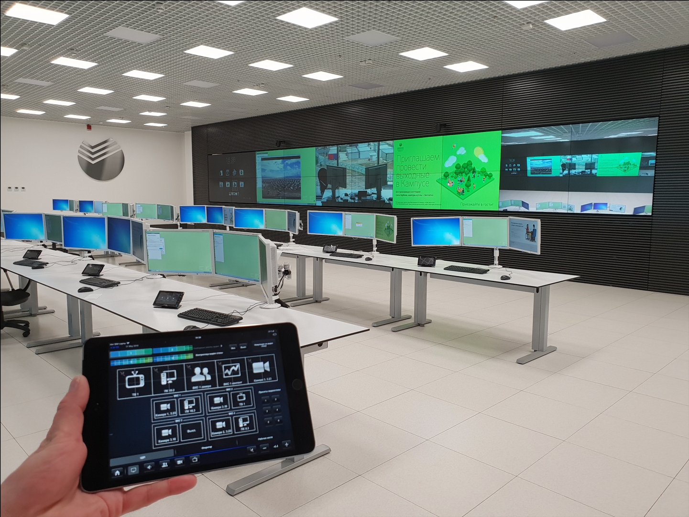
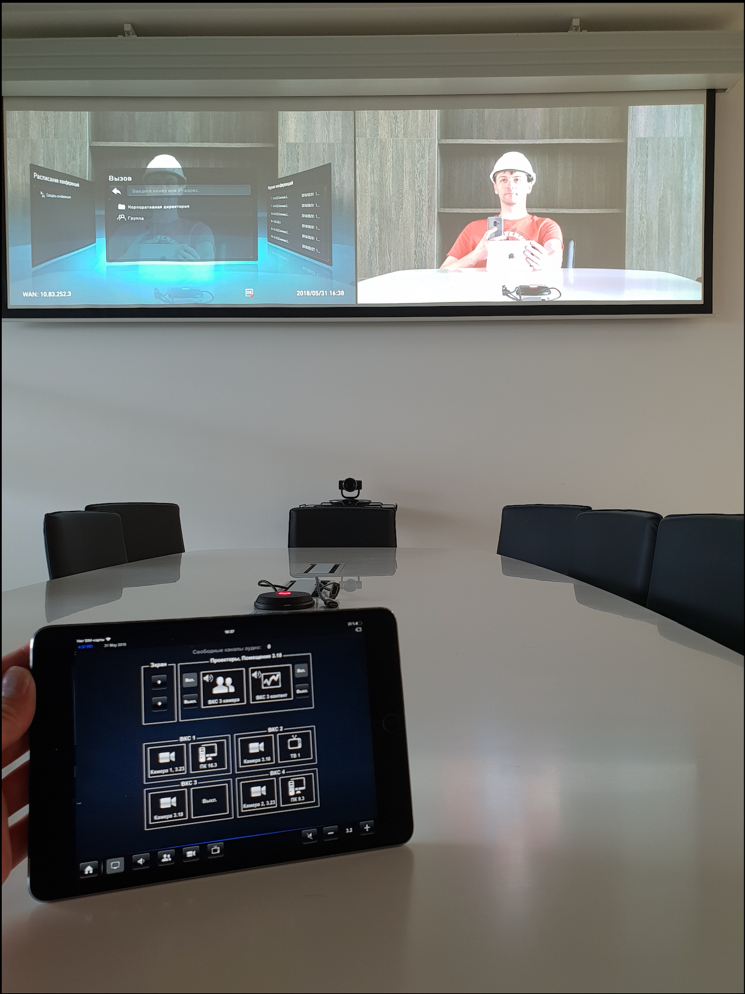
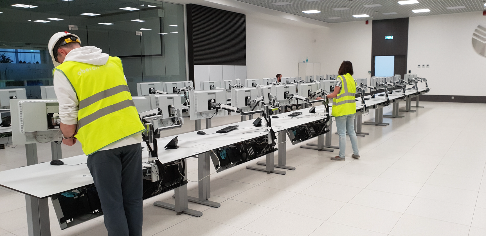
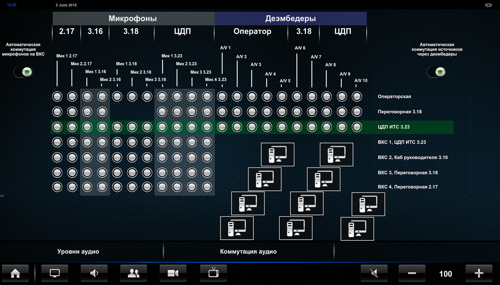
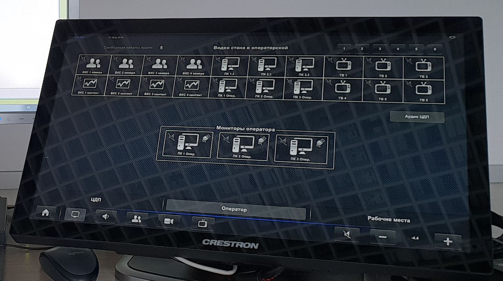

# Crestron program example

This is a classic example of the Crestron Program for Situational Centres with 16 working places and 1 operator place. 

Additionally, there are a couple of conference rooms and a chairperson cabinet.

Each of the 16 working places has its own touch panel with specific personal functionality.

There are also 3 monitors, a keyboard and a mouse at each working places. The user at the workplace can connect video, audio and USB from any of the 60 workstations located in the server room. One workstation can be connected simultaneously to only 3 physical PCs.

To implement this function we have used the fiber optic matrix switcher Extron FOX Matrix 320x which alow switching not only the audio and video but also USB.

Video here.

For audio commutation and processing purposes, we have used QSYS audio matrix.

Audio sources can be switched both manually and automatically.

In addition, you can connect additional sound sources through de-embedders. But since their significance is limited, a specific number of additional sound sources are allocated to certain rooms. For example, you can connect 5 additional sound sources to the control room, 3 to the main room of the situation center, and 2 to the meeting room.

This functionality can work both manually and automatically.

In addition, the operator can listen to any device or connect USB to any PC connected to the video wall or to their monitors.

To listen to an audio source switched, for example, to a video wall, you need to click on the crossed out speaker icon in the upper left corner of the video-output button. 
 - After this, the speaker icon will no longer be transparent and will be crossed out. 
 - This button will be active provided that the video source has an audio output.

The icon in the upper right corner of the video output button is intended for switching the USB of the workplace or operator's place to sources with USB output. 
 - If the video source does not have a USB output, this button will be hidden

